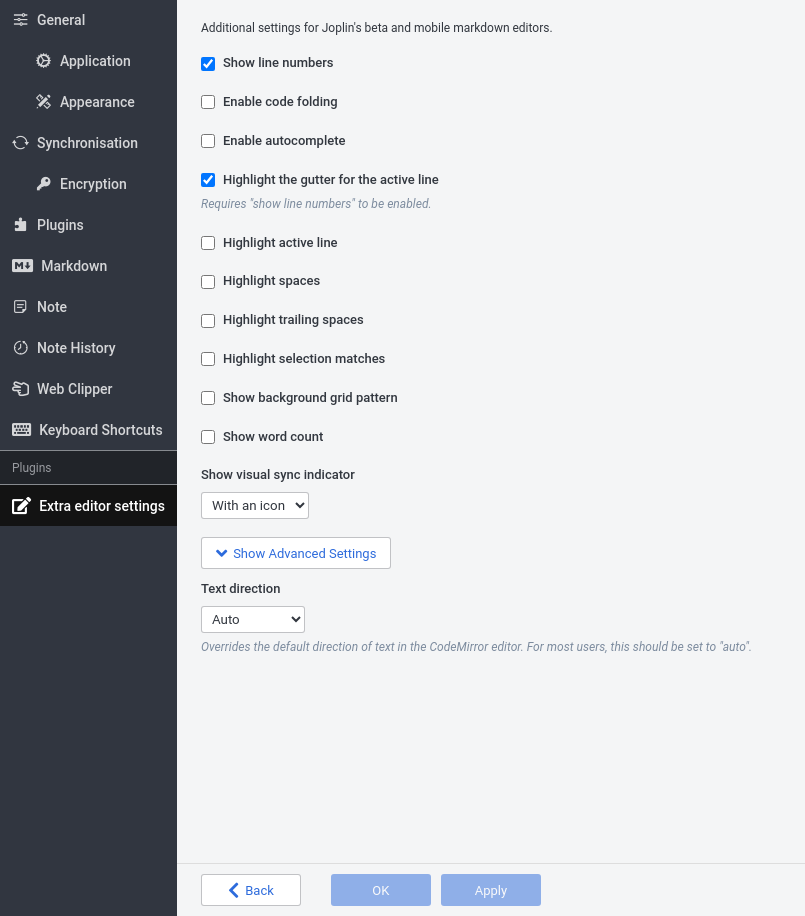

# Extended Markdown editor settings

This plugin adds several additional Markdown editor settings. Many of these settings are built in to Joplin's [CodeMirror](https://codemirror.net/) editor.

**In Joplin Desktop < 3.1.x**: To use this plugin, first enable the beta editor in settings (Options > General > Opt in to the editor beta).

## Available settings

- **Show line numbers**: Shows line numbers to the left of the editor.
- **Enable code folding**: Adds expand/collapse buttons to the editor gutter.
- **Enable autocomplete**: Shows a completion dialog in certain code blocks.
- **Highlight the gutter for the active line**: If a gutter is shown (e.g. for line numbers), the gutter for the current line is shown in a different color.
- **Highlight spaces**: Makes spaces and tabs visible.
- **Highlight trailing spaces**: Highlights space characters at the end of lines.
- **Highlight selection matches**: If text is selected, other visible instances of the same text are highlighted.
- **Show background grid pattern**: Shows a grid pattern behind the editor's content.
- **Show word count**: Adds a panel that shows the number of words in the open note. This number is calculated differently from Joplin's built-in word counter.
- **Show visual sync indicator**: Shows an icon or text panel that indicates Joplin's current sync status.
- **Hide Markdown**: Hides or replaces formatting markup. For example, clickable checkboxes added to the start of items in checklist markup.
- **Text direction** (advanced): Allows setting the editor's text direction to right-to-left or left-to-right for all lines, regardless of system language settings.

### More information: The "Hide Markdown" setting

The "Hide Markdown" setting hides or replaces Markdown on lines that don't contain the cursor.

In particular, setting "Hide Markdown" to "Some", makes the following changes:
- **Checkbox markup:** Replaced with checkboxes:   
  
- **Links:** In links in `[title](url)` format, URLs and brackets are hidden:  
    
  At present, clicking links does not follow them.
- **Headings:** `#`s are hidden:  
     
   Above, the cusror is on the same line as the `# Test` heading. As a result, its leading `#` markup is visible.
- **Bold/italic/code markup:** Formatting characters (e.g. `**`) are hidden:  
  
- **Blockquotes:** `>`s are hidden:  
  

